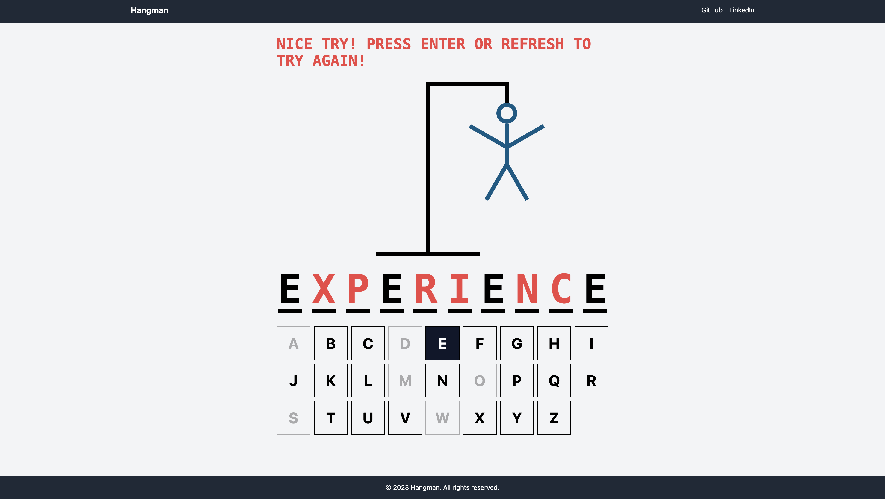
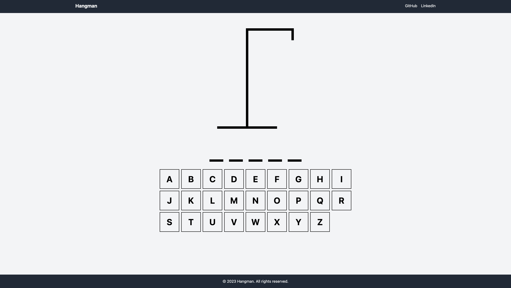

# hangman
a game in which the player tries to guess the letters of a word, and failed attempts are recorded by drawing a gallows and someone hanging on it, line by line.

built with vite + react + typescript. 

instructions to get up and running: 
1) clone this repository
2) in your terminal, cd to the root directory of the project and run npm install, then npm run dev

# Screenshots

