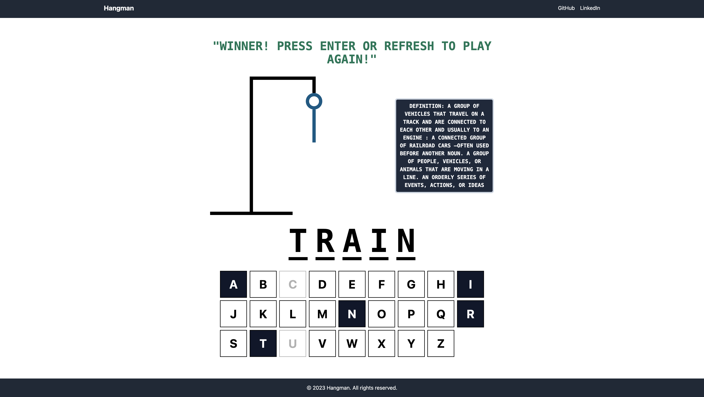

# Hangman Dictionary
Hangman Dictionary is intended to be a learning game to help improve vocabulary in a fun way, which is especially useful to new learners. 
Hangman is a game in which the player tries to guess the letters of a word, and failed attempts are recorded by drawing a gallows and someone hanging on it, line by line.
You can play classic Hangman while being provided a corresponding definition for each word at the end of the game. You can also click the hint button for help.  

built with vite + react + typescript. 
styled with tailwind css.
merriam-webster dictionary api for definitions.

installation instructions to get up and running: 
1) clone this repository
2) in your terminal, cd to the root directory of the project and run npm install, then npm run dev

Note: Using Merriam Webster's Learner's Dictionary API for definitions (https://dictionaryapi.com/products/api-learners-dictionary). 
Please follow the steps at https://dictionaryapi.com/ to get setup with an API key. Then, on App.tsx, update DEVELOPER_KEY to your key. 

## Screenshots

### Landing Page

### Show Hint

### Try Again

### Winner

